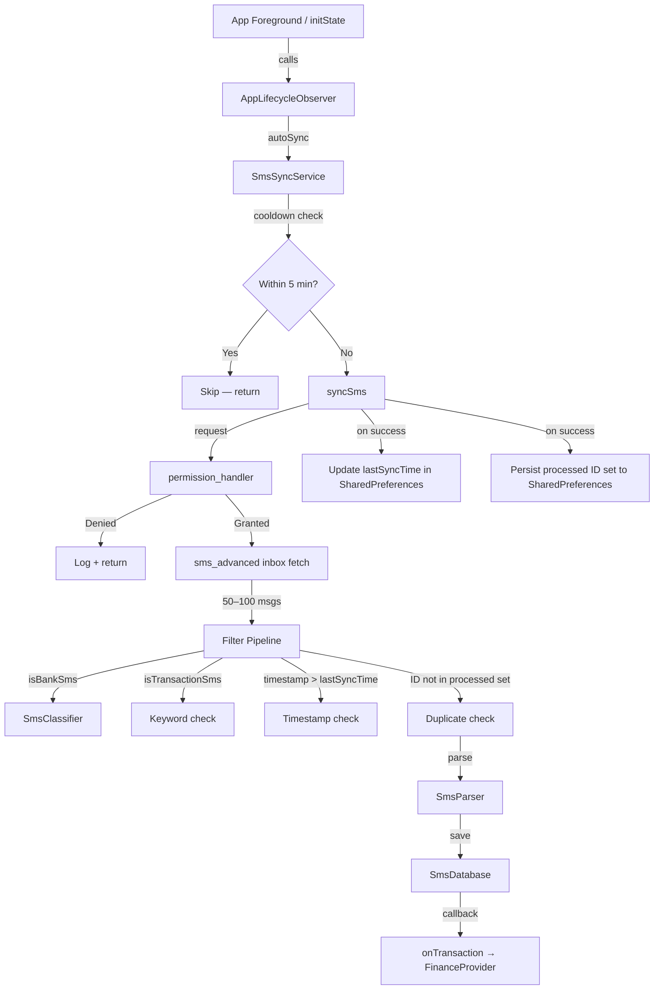

# Design Document: Auto SMS Sync

## Overview

Auto SMS Sync adds lifecycle-aware, incremental inbox reading to SmartFin. When the app starts or returns to the foreground, `SmsSyncService` reads the device inbox via `sms_advanced`, filters for new transaction-related messages, parses them, and persists them to the existing SQLite store — all without blocking the UI.

This feature complements the existing real-time `SmsPipeline` (which handles *incoming* SMS via `EventChannel`) by back-filling *historical* inbox messages that arrived while the app was closed or backgrounded.

### Key Design Goals

- **Non-blocking**: sync runs entirely in the background; the widget tree is never blocked.
- **Idempotent**: each SMS is processed exactly once across app restarts via a persisted ID set.
- **Cooldown-guarded**: a 5-minute cooldown prevents redundant reads on rapid foreground/background cycles.
- **Decoupled**: `SmsSyncService` has no UI dependencies; it reuses existing `SmsClassifier`, `SmsParser`, and `SmsDatabase`.

---

## Architecture

The feature introduces one new service class and one new mixin/observer, wired into the existing app lifecycle:



### Relationship to Existing Services

| Existing Service | Role in Auto SMS Sync |
|---|---|
| `SmsClassifier` | Primary bank/transaction filter (sender + body keywords) |
| `SmsParser` | Extracts structured `SmsTransaction` from raw SMS body |
| `SmsDatabase` | Persists parsed transactions to SQLite |
| `SmsPipeline` | Handles *real-time* incoming SMS — unchanged by this feature |
| `SmsService` | Android `EventChannel` bridge — unchanged |

`SmsSyncService` follows the same singleton pattern and `onTransaction` callback contract as `SmsPipeline`.

---

## Components and Interfaces

### SmsSyncService

**File**: `frontend/lib/services/sms_sync_service.dart`

```dart
class SmsSyncService {
  SmsSyncService._();
  static final SmsSyncService instance = SmsSyncService._();

  /// Wired to FinanceProvider.prependSmsTransaction in main.dart,
  /// matching the SmsPipeline.onTransaction pattern.
  void Function(SmsTransaction)? onTransaction;

  /// Lifecycle entry point. Checks cooldown, then delegates to syncSms().
  /// Must NOT be awaited at the call site.
  Future<void> autoSync() async { ... }

  /// Full sync: permission check → inbox fetch → filter → parse → save.
  /// Bypasses the cooldown guard (used by manual refresh button).
  Future<void> syncSms() async { ... }

  /// Returns true iff the message body contains 'debited', 'credited',
  /// or 'INR' (case-insensitive).
  bool isTransactionSms(SmsMessage message) { ... }
}
```

**Imports allowed**: `package:flutter/foundation.dart` (for `debugPrint` / `kDebugMode`) only. No widget or material imports.

**SharedPreferences keys**:
- `sms_sync_last_sync_time` — ISO 8601 string of last successful sync
- `sms_sync_processed_ids` — JSON-encoded `List<String>` of processed SMS identifiers

### AppLifecycleObserver

Integrated into the app's root widget (`_AuthWrapperState` or a dedicated wrapper). Implements `WidgetsBindingObserver`:

```dart
mixin AppLifecycleObserver on State<T> implements WidgetsBindingObserver {
  @override
  void initState() {
    super.initState();
    WidgetsBinding.instance.addObserver(this);
    SmsSyncService.instance.autoSync(); // fire-and-forget
  }

  @override
  void didChangeAppLifecycleState(AppLifecycleState state) {
    if (state == AppLifecycleState.resumed) {
      SmsSyncService.instance.autoSync(); // fire-and-forget
    }
  }

  @override
  void dispose() {
    WidgetsBinding.instance.removeObserver(this);
    super.dispose();
  }
}
```

Only `AppLifecycleState.resumed` triggers `autoSync()`. All other states (`paused`, `inactive`, `detached`, `hidden`) are ignored.

### AndroidManifest Changes

Add `READ_SMS` permission alongside the existing `RECEIVE_SMS`:

```xml
<uses-permission android:name="android.permission.READ_SMS" />
```

### pubspec.yaml Changes

Add two new dependencies:

```yaml
sms_advanced: ^1.0.0        # inbox reading
permission_handler: ^11.0.0  # runtime READ_SMS permission
```

---

## Data Models

No new data models are introduced. The feature reuses:

- **`SmsMessage`** (`sms_service.dart`) — the shared message DTO used across `SmsService`, `SmsClassifier`, `SmsParser`, and now `SmsSyncService`.
- **`SmsTransaction`** (`sms_transaction.dart`) — the parsed domain model.
- **`BankSmsRecord`** (`bank_sms_record.dart`) — the SQLite storage model.

### SharedPreferences Schema

| Key | Type | Description |
|---|---|---|
| `sms_sync_last_sync_time` | `String` (ISO 8601) | Timestamp of last successful sync |
| `sms_sync_processed_ids` | `String` (JSON array) | List of processed SMS identifiers |

**SMS Identifier computation**:
1. If the `sms_advanced` message provides a platform message ID → use it directly.
2. Otherwise → `"${message.sender}_${message.timestamp.millisecondsSinceEpoch}"`.

The processed ID set is loaded once at the start of `syncSms()` and persisted once at the end, not per-message.

### Filter Pipeline

Messages pass through three sequential gates before being processed:

```
isBankSms(msg)           → SmsClassifier (sender pattern + body keywords)
  AND isTransactionSms(msg) → keyword check: debited | credited | INR
  AND msg.timestamp > lastSyncTime
  AND msg.id NOT IN processedIds
```

All four conditions must be true for a message to be parsed and saved.

---

## Correctness Properties

*A property is a characteristic or behavior that should hold true across all valid executions of a system — essentially, a formal statement about what the system should do. Properties serve as the bridge between human-readable specifications and machine-verifiable correctness guarantees.*

### Property 1: isTransactionSms keyword contract

*For any* SMS message, `isTransactionSms()` SHALL return `true` if and only if the message body contains at least one of the strings `debited`, `credited`, or `INR` (case-insensitive), and `false` otherwise.

**Validates: Requirements 5.1**

---

### Property 2: Cooldown guard — within window skips sync

*For any* `lastSyncTime` value that is strictly less than 300 seconds before the current time, calling `autoSync()` SHALL NOT invoke `syncSms()`.

**Validates: Requirements 3.2**

---

### Property 3: Cooldown guard — outside window triggers sync

*For any* `lastSyncTime` value that is greater than or equal to 300 seconds before the current time, or when no `lastSyncTime` exists, calling `autoSync()` SHALL invoke `syncSms()`.

**Validates: Requirements 3.3**

---

### Property 4: Timestamp filter excludes old messages

*For any* inbox batch containing messages with timestamps on or before `lastSyncTime`, none of those messages SHALL be passed to `SmsParser.parse()` or saved to `SmsDatabase`.

**Validates: Requirements 5.4**

---

### Property 5: Duplicate prevention — already-processed messages are skipped

*For any* message whose computed identifier is already present in the persisted processed-ID set, `SmsSyncService` SHALL NOT call `SmsDatabase.saveTransaction()` for that message.

**Validates: Requirements 6.3**

---

### Property 6: Processed ID persistence round-trip

*For any* message that is successfully saved to `SmsDatabase`, its computed identifier SHALL appear in the processed-ID set that is subsequently read from `SharedPreferences`.

**Validates: Requirements 6.4**

---

### Property 7: Exception during fetch does not update lastSyncTime

*For any* exception thrown by the `sms_advanced` inbox fetch, `syncSms()` SHALL catch the exception and SHALL NOT write a new `lastSyncTime` to `SharedPreferences`.

**Validates: Requirements 4.4, 8.3**

---

### Property 8: Non-resumed lifecycle states do not trigger autoSync

*For any* `AppLifecycleState` value that is not `AppLifecycleState.resumed`, calling `didChangeAppLifecycleState()` with that state SHALL NOT invoke `SmsSyncService.instance.autoSync()`.

**Validates: Requirements 2.5**

---

### Property 9: onTransaction callback fires for every saved transaction

*For any* message that passes all filters and is successfully saved to `SmsDatabase`, the registered `onTransaction` callback SHALL be invoked exactly once with the corresponding `SmsTransaction`.

**Validates: Requirements 7.5**

---

### Property 10: Database duplicate insert is idempotent

*For any* `SmsTransaction`, calling `SmsDatabase.saveTransaction()` twice with the same `sender + timestamp + body` SHALL result in exactly one record in the database (the second insert is silently ignored).

**Validates: Requirements 7.4**

---

## Error Handling

| Scenario | Behavior |
|---|---|
| `READ_SMS` permission denied | Log debug message, return from `syncSms()`, do NOT update `lastSyncTime` |
| `sms_advanced` throws during fetch | Catch exception, log debug message, return, do NOT update `lastSyncTime` |
| `SmsParser.parse()` throws | `SmsParser` is documented to never throw; if it does, the exception propagates to `syncSms()` which should catch it and log |
| `SmsDatabase.saveTransaction()` fails | Log error, continue processing remaining messages, do NOT add ID to processed set for failed saves |
| `SharedPreferences` read/write fails | Log error, continue with in-memory state for the current sync cycle |
| Empty inbox batch | Complete normally, update `lastSyncTime` |
| All messages filtered out | Complete normally, update `lastSyncTime` |

All errors are logged via `debugPrint` (guarded by `kDebugMode`). No errors are surfaced to the user from the service layer — the calling widget is responsible for any user-facing error display.

---

## Testing Strategy

### Unit Tests (example-based)

Located in `frontend/test/sms_sync_service_test.dart`.

Cover specific scenarios:
- Permission denied → sync aborted, `lastSyncTime` not updated
- Permission granted → inbox fetch proceeds
- Empty inbox → `lastSyncTime` updated, no errors
- `syncSms()` called directly bypasses cooldown
- `lastSyncTime` written as ISO 8601 under correct key
- Processed ID set loaded once at start, persisted once at end
- `SmsParser.parse()` called for each message passing all filters
- `SmsDatabase.saveTransaction()` called with parsed transaction
- `onTransaction` callback invoked after successful save

### Property-Based Tests

Located in `frontend/test/sms_sync_service_property_test.dart`.

Uses the [`dart_test`](https://pub.dev/packages/test) framework with manual property harnesses (Dart does not have a mainstream PBT library equivalent to QuickCheck, so properties are implemented as parameterized tests with randomized inputs using `dart:math` `Random`).

Each property test runs a minimum of **100 iterations**.

Tag format: `// Feature: auto-sms-sync, Property N: <property_text>`

| Property | Test Description |
|---|---|
| P1: isTransactionSms keyword contract | Generate random bodies with/without keywords; verify return value matches keyword presence |
| P2: Cooldown within window | Generate random `lastSyncTime` in `[now - 299s, now]`; verify `syncSms` not called |
| P3: Cooldown outside window | Generate random `lastSyncTime` >= 300s ago or null; verify `syncSms` called |
| P4: Timestamp filter | Generate messages with timestamps before/at/after `lastSyncTime`; verify only post-`lastSyncTime` messages are processed |
| P5: Duplicate prevention | Pre-populate processed set with message IDs; verify `saveTransaction` never called for those messages |
| P6: Processed ID round-trip | Save a message; verify its ID appears in the persisted set |
| P7: Exception does not update lastSyncTime | Throw various exception types from fetch mock; verify `lastSyncTime` not written |
| P8: Non-resumed states | Enumerate all non-resumed `AppLifecycleState` values; verify `autoSync` not called |
| P9: onTransaction callback | Generate random valid messages; verify callback called once per saved transaction |
| P10: Database idempotency | Insert same transaction twice; verify single row in database |

### Widget Tests

Located in `frontend/test/app_lifecycle_observer_test.dart`.

- `initState` triggers `autoSync()`
- `AppLifecycleState.resumed` triggers `autoSync()`
- `dispose` removes observer from `WidgetsBinding`
- Manual refresh button calls `syncSms()` directly
- Loading indicator shown/hidden around `syncSms()`
- Error message displayed when `syncSms()` throws

### Integration Considerations

- `sms_advanced` and `permission_handler` require a real Android device or emulator; mock them in unit/property tests.
- `SmsDatabase` uses `sqflite` which supports in-memory databases for testing (`openDatabase(':memory:')`).
- `SharedPreferences` can be mocked using `SharedPreferences.setMockInitialValues({})` in tests.
